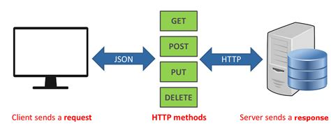
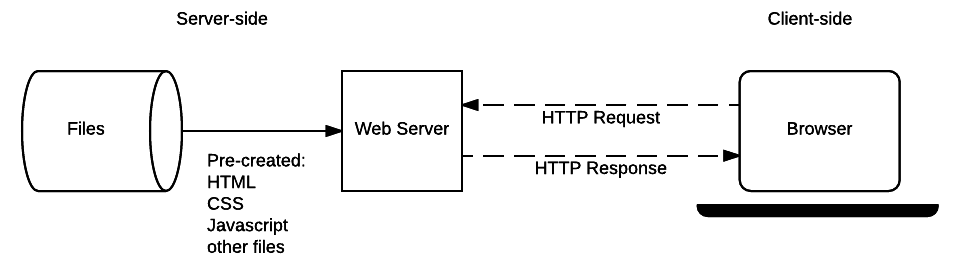

# API


## What are API's
- Application Programming Interface
- How software can communicate with one another
## API diagram
- Client 
- API 
- Server




Client sends http methods to api, api sends JSON back
api sends http request to server, server sends Your data back


## What is a HTTP request?
HTTP stands for Hyper text transfer protocol. The HTTP request is created in the browser from where the client sends the request to the server.

###Showcase a HTTP request visually



## What is a HTTP response?
The HTTP response is the response that is generated in relation to a request 


### Showcase a HTTP response visually


### How can data be represented in an API call? (JSON example and XML example)


### HTTP 'GET' (how to ask for data from an API)
Python has a requests library for this purpose which comes with a .get method.

The following code should return <Response [200]>. This response means the request is successful. 

```
import requests
import json

post_codes_req = requests.get("https://api.postcodes.io/postcodes/se120nb")
```

from here we can request more data like headers,

`post_codes_req.headers`

### HTTP verbs: POST, PUT, PATCH, DELETE


- How is data returned to the requester? (what language?)
- Types of API
- What is a REST API (RESTful API)?
- What makes an API RESTful?
- Explain stateless API vs stateful API
- Which is better and why?
- Caching -> What is the reason for it?
- Examples of API's being used on 2 different websites
- Examples of popular API's


# API WALKTHROUGH
import requests
import json

post_codes_req = requests.get("https://api.postcodes.io/postcodes/se120nb")

print(post_codes_req) # <Response [200]>

print(post_codes_req.status_code) # 200
print(post_codes_req.headers) # http headers returned
print(post_codes_req.content) # raw content
print(post_codes_req.json()) # json content
print(type(post_codes_req.json())) # <class 'dict'>

json_body = json.dumps({"postcodes":["PR8 0SG","M45 6GN","EX165BL"]})
headers = {"Content-Type": "application/json"}

#dont need to add the end part on this request because asking for specific data from the API
post_multi_req = requests.post("https://api.postcodes.io/postcodes", headers=headers, data=json_body)

print(post_multi_req.json())
